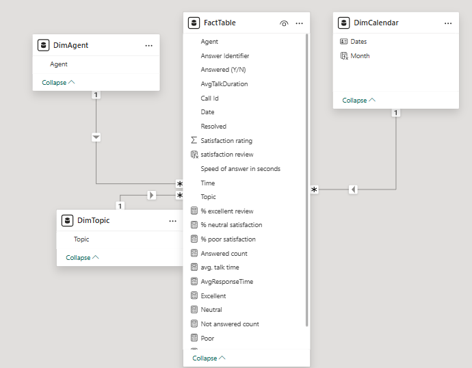

## **Project Name:**  
Call Centre Trends Analysis & Performance Insights  

## **Project Overview: Call Centre Trends Dashboard**  
PhoneNow is a leading telecommunications company that provides customer support services worldwide through its call centre operations. With thousands of customer interactions daily, PhoneNow aims to enhance customer experience, operational efficiency, and agent performance by leveraging data-driven insights.  

## **Problem Statement:**  
PhoneNow’s call centre generates a vast amount of data related to customer interactions, service efficiency, and agent productivity. However, this data has been underutilized in identifying performance trends and improvement areas. This project aims to thoroughly analyze and synthesize call centre data to uncover critical insights that will enhance customer satisfaction, optimize response times, and improve overall call centre operations.  
---
## **Data Description**

---
## **Methodology**
### **1. Data Collection**
- The dataset consists of call center metrics such as:
  - Calls  
  - Answered Calls  
  - Abandoned Calls  
  - Response Time  
  - Call Duration  
  - Customer Satisfaction Ratings  
- The data was extracted from the call center's internal systems and provided by the client.

### **2. Data Cleaning & Preprocessing**
- **Checked for missing values**: Ensured there were no null or inconsistent records.  
- **Standardized date formats**: Converted timestamps to a consistent format for trend analysis.  
- **Categorized customer satisfaction ratings** into Excellent, Neutral, and Poor based on given thresholds.  

### **3. Data Analysis & Visualization**
- **Call Performance Metrics**:
  - Calculated the call answer rate and abandonment rate.
  - Measured the average response time and call duration.
- **Customer Satisfaction Trends**:
  - Aggregated satisfaction scores by month.
  - Used percentage distribution to analyze trends over time.
- **Time Series Analysis**:
  - Evaluated patterns in call volumes and satisfaction across different months.

### **4. Dashboard Development**
- **Tools Used**: Power BI  
- **Visuals Created**:
  - **KPIs** for key metrics (Total Calls, Answered Calls, Abandoned Calls, etc.).
  - **Bar Charts** for call handling performance.
  - **Pie Charts** for customer satisfaction distribution.
  - **Line Charts** for call volume trends.
  - **Stacked Bar Charts** for monthly satisfaction trends.

### **5. Insights & Recommendations**
- Derived actionable insights from the data, focusing on:
  - Reducing abandoned call rates.
  - Improving response time efficiency.
  - Enhancing customer satisfaction based on trend analysis.
- Suggested data-driven strategies for call center management.
---

## **Key Focus Areas:**  
This project will focus on analyzing key call centre metrics, including:  
- **Total number of calls answered and abandoned**  
- **Speed of answer and response time trends**  
- **Average call duration and efficiency**  
- **Customer satisfaction scores and feedback trends**  
- **Agent performance and workload distribution**  

---

### **1. Call Handling Performance**  
- **Total Calls:** 5000
- **Answered Calls:** 4054 (80% of total calls)  
- **Abandoned Calls:** 946 (19% abandonment rate)  
- **Resolved Calls:** 3,646 (91% of answered calls)  
🔹 **Insight:** High call answer rate, but nearly 1 in 5 calls are abandoned, indicating potential staffing or efficiency issues.

---

### **2. Response Time & Call Duration**  
- **Average Response Time:** **1 minute 8 seconds**  
- **Average Call Duration:** **3 minutes 45 seconds**  

🔹 **Insight:** While response time is relatively quick, optimizing it further could improve customer satisfaction.

---

### **3. Customer Satisfaction Trends**  
- **Overall Satisfaction Score:** **3.40/5**  
- **Breakdown:**  
  - **Excellent:** 40%  
  - **Neutral:** 24%  
  - **Poor:** 36%  

🔹 **Insight:** Over **one-third of customers are dissatisfied** (Poor rating). The trend suggests a **gradual decline in satisfaction over months**, with an increase in "Poor" ratings.

---

### **4. Monthly Trends in Satisfaction**  
| Month | Excellent (%) | Neutral (%) | Poor (%) |
|-------|-------------|-------------|----------|
| **January** | 41.25% | 25.79% | 32.96% |
| **February** | 40.59% | 22.83% | 36.57% |
| **March** | 39.45% | 24.32% | 36.23% |

🔹 **Insight:** A **slight decline in customer satisfaction** month-over-month, with "Poor" ratings increasing.
---

### **5. Agent Performance**
       
---
## **Dashboard**
The live dashboard is [here](https://app.powerbi.com/links/PHJSQTNC5Z?ctid=4331c42e-69e8-40d9-af18-dd96b78416b7&pbi_source=linkShare)

---
## **Recommendations for Improvement**
1. **Reduce Abandoned Calls:** Analyze peak call hours and allocate more agents during high-traffic periods.  
2. **Improve Customer Satisfaction:** Investigate why the **"Poor" rating is increasing**—possible causes include long wait times, unresolved issues, or poor agent communication.  
3. **Optimize Response Time:** Reducing the **1:08** response time may lead to fewer abandoned calls and better satisfaction.  
